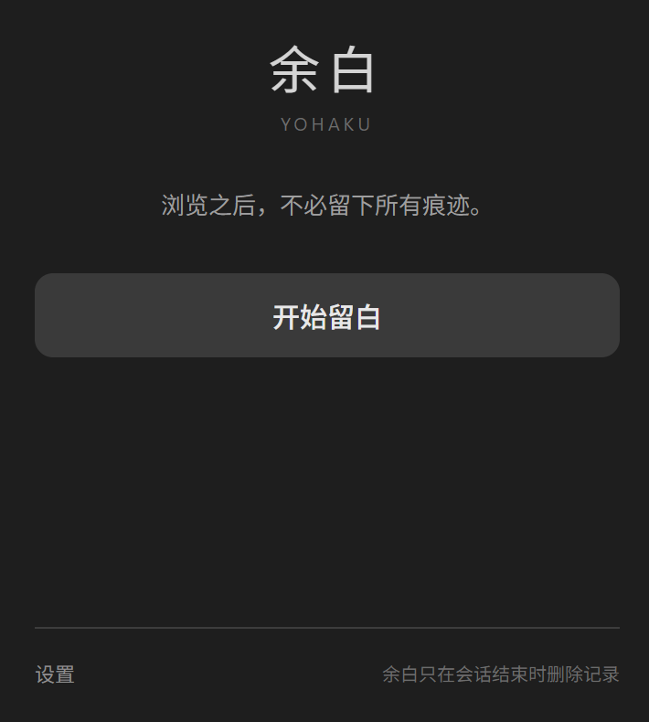
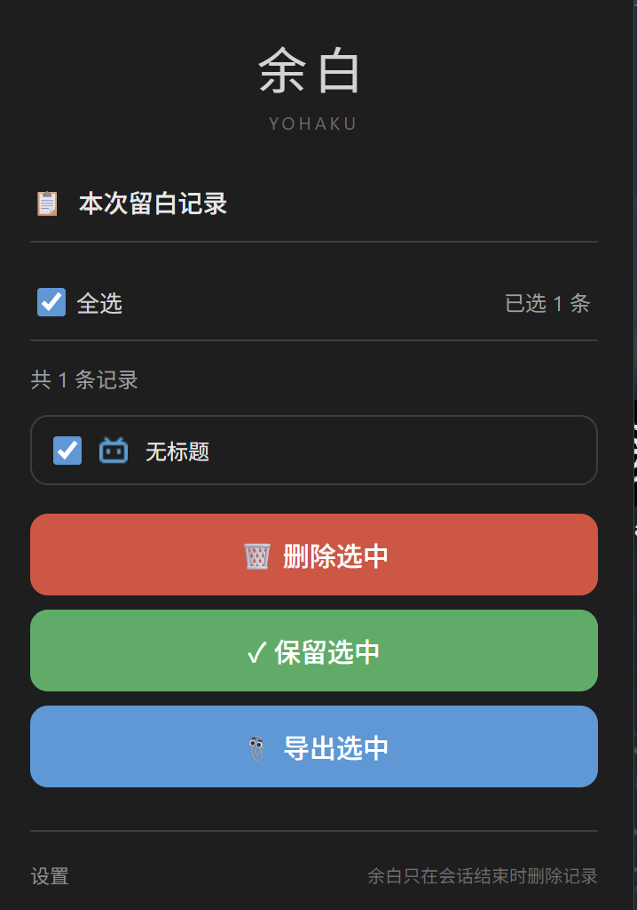
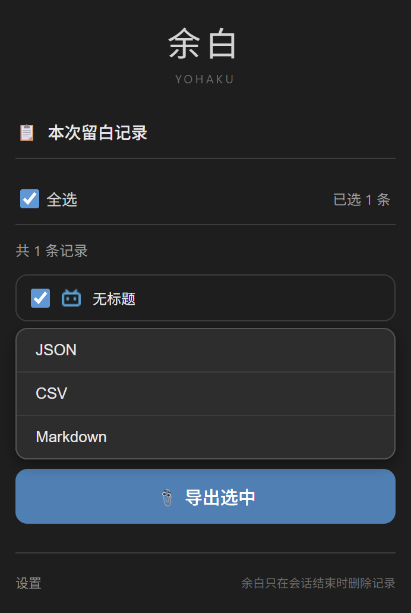

# 余白 Yohaku

> 浏览之后，不必留下所有痕迹。

Chrome 通常只有两种选择：

记录全部。\
或者完全无痕。

但有时候，

我只是想：

正常登录。\
正常浏览。\
正常打开标签页。

然后让这一段经历，

不一定永久留下。

所以有了余白。

它不会打断浏览，也不会像无痕模式一样隔离一切。

只是让你在结束之后，再决定：

什么留下。

什么成为余白。

------------------------------------------------------------------------

## ✨ 功能特性

### 🌙 留白会话

开始留白之后，

一切和平时一样。

-   登录状态保留
-   Cookie 保留
-   标签页保留
-   不影响正常浏览体验

浏览结束后，再决定这段经历是否留下。

### 📝 记录选择

不是全部删除。

也不是全部保留。

而是自己决定：

-   留下什么
-   删除什么
-   导出什么

### 📤 导出记录

支持：

-   JSON
-   CSV
-   Markdown

有些东西不一定要留在浏览器里。

但可以留下给自己。

### 🎨 深色模式

支持：

-   浅色
-   深色
-   跟随系统

### 🔄 状态持久化

即使浏览器意外关闭：

-   会话状态自动恢复
-   当前留白不会丢失

------------------------------------------------------------------------

## 为什么叫「余白」

在设计里，

余白并不是空白。

而是刻意留下来的空间。

浏览记录也是。

有些东西值得留下。

有些东西，只适合经过。

------------------------------------------------------------------------

## 📸 截图

### 主界面



### 记录管理



### 导出选项



------------------------------------------------------------------------

## 🚀 使用方式

1.  点击浏览器工具栏中的余白图标
2.  点击「开始留白」
3.  像平时一样浏览网页
4.  浏览结束后点击「结束留白」
5.  选择：
    -   删除选中
    -   保留选中
    -   导出选中

------------------------------------------------------------------------

## 📥 安装

### 从 GitHub Releases 安装（推荐）

1.  下载最新版本 `yohaku.crx`
2.  打开 `chrome://extensions/`
3.  开启右上角「开发者模式」
4.  将 `.crx` 文件拖入页面
5.  点击「添加扩展程序」

### 从源码安装

``` bash
git clone https://github.com/smallksh/Yohaku.git
```

然后：

1.  打开 `chrome://extensions/`
2.  开启开发者模式
3.  点击「加载已解压的扩展程序」
4.  选择项目目录

------------------------------------------------------------------------

## 📄 开源协议

MIT License © 2026 smallksh
